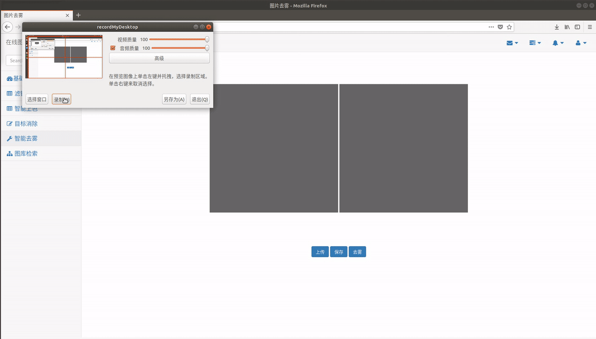

# Image Process System
> Author: Yuchao Gu

> E-mail: 2015014178@buct.edu.cn

> Date: 2018-04-12

>Description: 胡伟老师15级数字媒体课程设计，完成了numpy优化的基础图片处理以及目标移除、灰度上色、图像去雾、图像检索等高级处理，此外，本系统综合了mysql与七牛云数据库，完成图片数据的存储管理。

##结果展示

###图像去雾
实现了何凯明的《Single Image Haze Removal Using Dark Channel Prior》和引导滤波，配合前端展示



###灰度图上色
实现了论文 Levin et. al《Colorization Using Optimization》，配合前端canvas交互，完成交互上色功能


###目标移除
实现了Shai Avidan 的《Seam Carving for Content-Aware Image Resizing》，将基础的seam carving与论文中提出的基于seam的object remove结合，配合前端canvas的交互标记区域，实现交互删除功能


###图像检索
基于sift特征点提取和特征聚类，flann快速匹配，实现快速图像检索功能。调用了opencv相应函数，配合前端展示。

###基础图像处理
* 对比度，亮度，饱和度调整，全是手工实现，其中转换hsv与rgb的算法，用numpy优化过，没有出现for循环，加快了处理效率
* 各种滤波方法，全是手工实现

##局限与不足
本课设存在以下局限，供参考者改进：

* seam-carving没有完成基于seam的enlarge，目标移除后只是简单的scale成原尺寸，若删除区域过大可能失真

##代码结构
```
Image Process System
│
├── gycImgProcess  # 本项目的图片处理代码包，代码封装成包，实现前端调用接口
│   ├──Basicprocess.py  # 亮度、饱和度、对比度的numpy优化实现，基础色彩空间变换以及与前端base64的图片编码转换
│   ├── Imagemerge.py # 简单的图片融合
│   ├── Filtering.py # 各种滤波方法的手工实现
│   ├── Colorized.py  # 灰度图上色的实现，参考论文《Colorization Using Optimization》
│   ├── Dehaze.py # 去雾算法的实现，参考论文 《Single Image Haze Removal Using Dark Channel Prior》
│   └── Seamcaving.py # 目标移除的实现，参考论文《Seam Carving for Content-Aware Image Resizing》
│ 
├── readmeDisplay # 存放本说明文件使用的图片数据
│ 
├── gycOsUtils # 存放项目中文件操作的代码
│ 
├── gycQiniuUtils # 封装与七牛云云数据库交互的代码
│ 
├── gycMysqlUtils # 存放与本地mysql交互的代码
│ 
├── templates # 存放网页展示所需的html
│   ├── colorizer.html  # 灰度图上色的html文件
│   ├── dehaze.html # 去雾算法的html文件
│   ├──  filter.html # 滤波算法的html文件
│   ├── foundation.html  # 基础对比度变换等算法的html文件
│   ├── login.html # 登陆页
│   ├── objectremove.html # 目标移除算法的html文件
│   ├── register.html  # 注册页
│   ├── search.html # 图像检索的html文件
│   └── thumbnail.html # 个人云数据库图片展示页
│
├── main.py # 后端代码
│
├── static # 存放jquery，bootstrap等js，css库文件
│   ├── js/myjs  # 每个html对应的js文件，实现了与后台的交互
│   └── other files # 其余js库文件
│
├── wljsearch # 图像检索部分
│
├── testfiles # 包含每个模块的测试用图
│
└── readme.md # 此说明文件
```

## 环境

* `Python 3.6 `

* 依赖：`flask` `jquery` `opencv-python`

* 系统支持：`ubuntu` 

* 编程环境:`pycharm`

##致谢
本课设感谢胡伟老师对算法的指导以及  [`wlj961012`](https://github.com/wlj961012/DigitalMedia) 提供的关于图像检索的理解与参考代码
